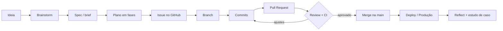

# Guia do Agente Meriadoque

Manual do seu agente em linguagem simples. Os termos técnicos têm legenda 📖
e estão explicados no glossário, no final.

---

## 1. A ideia em uma frase

Você descreve **o que** quer. O agente conversa com você até a ideia ficar boa,
planeja, executa em segurança, revisa e **lembra do que aprendeu** para a próxima vez.

Analogia (é a mesma do Noodle): uma **cozinha de restaurante**.

| Cozinha | No projeto |
|---|---|
| Cliente faz o pedido | Você traz uma ideia |
| Maître conversa e sugere o prato | Skill `brainstorm` |
| Chef monta a receita | Skill `plan` |
| Comanda na parede | `todos.md` (backlog 📖) |
| Chef de cozinha distribui as comandas | Skill `schedule` (Noodle) |
| Cozinheiros, cada um na sua bancada | Skill `execute`, cada um numa worktree 📖 |
| Provador antes de servir | Skill `review` |
| Caderno de receitas da casa | `brain/` (memória) |

---

## 2. As peças

| Peça | Onde fica | O que faz |
|---|---|---|
| **Noodle** | programa `noodle` | Orquestrador 📖: lê o backlog, decide o que fazer e dispara agentes. |
| **Skills** | `.agents/skills/` | "Manuais de procedimento" que o agente segue. |
| **brain** | `brain/` | Memória permanente: princípios, conhecimento, planos. |
| **AGENTS.md** | raiz | Regras que **todo** agente (Claude ou Gemini) lê. |
| **Hooks** | `.claude/hooks/` | Scripts automáticos (ex: ao abrir a sessão, mostra o índice do brain). |
| **todos.md** | raiz | Backlog: lista de tarefas aprovadas. |
| **estudos/** | raiz | Seus estudos de caso para o NotebookLM. |

---

## 3. Skills disponíveis

| Skill | Para que serve | Quando usar | Como pedir |
|---|---|---|---|
| `brainstorm` | Conversa que questiona e melhora sua ideia | Toda ideia nova | "Tenho uma ideia: ..." |
| `plan` | Quebra a ideia em fases pequenas | Depois do brainstorm | "Planeje isso" |
| `schedule` | Decide qual tarefa roda e com qual modelo | Automático (Noodle) | — |
| `execute` | Implementa, testa e faz commit 📖 | Automático (Noodle) | — |
| `review` | Revisão crítica de código ou plano | Antes de aceitar uma entrega | "Revise isso" |
| `reflect` | Salva aprendizados no brain | Fim de sessão, após erros | "Reflita" / "lembre disso" |
| `meditate` | Faxina e evolução do brain | De vez em quando | "Medite" |
| `ruminate` | Garimpa conversas antigas atrás de padrões | Mensal | "Rumine" |
| `brain` | Regras de escrita da memória | Usado pelas outras | — |
| `noodle` | Manual do próprio Noodle | Dúvidas sobre o Noodle | "Como uso o noodle?" |

---

## 4. Roteiro do dia a dia

1. **Ideia** → "Tenho uma ideia: um bot que resume meus e-mails."
2. **Brainstorm** → o agente pergunta, contesta, sugere caminhos. Vocês decidem juntos.
   Resultado: `brain/plans/<nome>/brief.md`.
3. **Plano** → "Planeje isso." Resultado: fases em `brain/plans/<nome>/`.
4. **Backlog** → a tarefa entra no `todos.md`.
5. **Execução** → `noodle start` no terminal. Os agentes trabalham em worktrees.
6. **Revisão** → você lê o Pull Request 📖, pede ajustes e aprova.
7. **Aprendizado** → "Reflita." E, se valeu a pena, um novo arquivo em `estudos/`.

Frases úteis:
- "Explique isso como se eu fosse estudante."
- "Anote essa correção no brain para não repetir."
- "Crie um estudo de caso disso."

---

## 5. Claude + Gemini (projeto híbrido)

**Dá para usar os dois. As regras são as mesmas, e cada um tem o seu papel.**

- Fonte única de regras: `AGENTS.md`.
  - Claude lê `CLAUDE.md`, que só contém `@AGENTS.md` (importa o arquivo).
  - Gemini CLI: `.gemini/settings.json` aponta para `AGENTS.md`.
  - AntiGravity: teste perguntando ao agente "quais regras do projeto você carregou?".
    Se ele não citar o `AGENTS.md`, me avise que ajustamos.
- Nada de criar `GEMINI.md`, `rules.md` ou cópias. Cópias divergem e viram lixo.

**Divisão de papéis sugerida**

| Tarefa | Quem |
|---|---|
| Loop do Noodle (schedule/execute) | Só Claude. O Noodle só aceita `claude` e `codex`. |
| Brainstorm | Qualquer um. Bom truque: pedir ao Gemini uma **segunda opinião** sobre o brief do Claude. |
| Pesquisa, rascunho de textos e documentação | Gemini (barato e rápido) |
| Revisão final | Claude |

**Riscos e como evitar**

- Dois agentes editando o **mesmo arquivo ao mesmo tempo** → um apaga o trabalho do
  outro. Regra: um agente por tarefa.
- Gemini não carrega as skills automaticamente → o `AGENTS.md` manda ele ler o
  `SKILL.md` relevante.
- Memórias paralelas → só existe o `brain/`. Nada de `memory.md` solto.

---

## 6. Um modelo para cada tarefa (economia de tokens 📖)

Regra: **cérebro caro para pensar, cérebro barato para digitar**.

| Tipo de tarefa | Modelo | Por quê |
|---|---|---|
| Brainstorm, arquitetura, plano, revisão | Claude Opus 5.5 | Raciocínio mais forte; um erro aqui custa caro depois. |
| Escrever código com plano definido | Claude Sonnet 5.5 | Ótimo em código e bem mais barato. |
| Docs, textos, arquivos simples, reflect | Claude Haiku 4.5 ou Gemini | Tarefa mecânica; não precisa do mais caro. |

Status: ✅ aplicado na skill `schedule` (ela escolhe o modelo de cada etapa) e no
padrão do `.noodle.toml` (Sonnet).
No chat interativo, você troca o modelo com `/model opus`, `/model sonnet` ou `/model haiku`.

---

## 7. Terminal + AntiGravity juntos

O AntiGravity é baseado no VS Code, então tem terminal embutido (menu *Terminal → New Terminal*).
Recomendação:

- **Painel de chat** (Claude/Gemini no AntiGravity) → conversar, brainstorm, estudar.
- **Terminal embutido** → `claude` (CLI), `gemini` (CLI), `noodle`, `git`. É aqui
  que você "fica por dentro": vê cada comando rodando.
- Os dois enxergam **a mesma pasta, os mesmos arquivos e as mesmas regras**.

---

## 8. Trabalhando como uma empresa

Todo projeto segue o mesmo ciclo que times de engenharia usam:

| Etapa | O que é | Artefato |
|---|---|---|
| Spec | Documento do que será feito e por quê | `brain/plans/<x>/brief.md` |
| Issue 📖 | Tarefa registrada no GitHub | Issue #N |
| Branch 📖 | Linha paralela de trabalho | `feat/nome-curto` |
| Commit | Salvamento com mensagem padrão | `feat(bot): adiciona resumo diário` |
| Pull Request | Pedido para juntar a branch na `main`, com descrição e revisão | PR #N |
| CI 📖 | Robô que roda testes/linter em todo PR | GitHub Actions |
| Merge | Junta a branch aprovada na `main` | — |
| Deploy 📖 | Publicar para uso real | Vercel (web), servidor, agendador |

**Regras de empresa que vamos adotar**
- A `main` é sagrada: ninguém faz commit direto nela.
- Todo PR tem descrição, liga a issue e passa no CI antes do merge.
- Mensagens de commit no padrão Conventional Commits (`feat`, `fix`, `docs`, `refactor`...).
- Cada projeto tem README, spec e um fluxograma.

**Backup**: todo repositório vai para o GitHub (privado ou público). Computador
quebrou? Um `git clone` e está tudo de volta.

---

## 9. Gaps operacionais encontrados (2026-09-29) e soluções

| # | Gap | Risco | Solução | Status |
|---|---|---|---|---|
| 1 | Nenhum repositório tem cópia no GitHub | **Perder tudo de novo** | Instalar `gh`, login, criar repo, `git push` | ⏳ precisa de você (login) |
| 2 | CLI `claude` não instalado no terminal | Noodle não consegue abrir agentes (`noodle start` falha) | `npm install -g @anthropic-ai/claude-code` | ⏳ |
| 3 | Python é só atalho da Microsoft Store | Automações e skill `ruminate` não rodam | `winget install Python.Python.3.12` | ⏳ |
| 4 | Gemini CLI não encontrado no PATH deste terminal | Uso híbrido pelo terminal não funciona | Instalar/checar Gemini CLI | ⏳ confirmar com você |
| 5 | `bash` fora do PATH | Scripts `.sh` do Noodle podem não rodar no Windows | Testados via Git Bash ✅; validar no primeiro `noodle start --once` | ⏳ |
| 6 | Tudo configurado em Opus | Custo alto | Roteamento por modelo (seção 6) | ✅ |
| 7 | Opção A (QG + repos separados) | Cada projeto novo precisa das skills/brain | Criar script/template de "novo projeto" | ⏳ próxima conversa |
| 8 | Identidade do Git só neste repo | Commits de outros projetos sem autor | `git config --global` | ⏳ |
| 9 | Branch se chama `master` | Fora do padrão de mercado (`main`) | `git branch -m master main` | ⏳ junto com o gap 1 |

---

## 10. Glossário

- **Agente** — uma IA que não só responde, mas executa ações (lê/escreve arquivos, roda comandos).
- **Backlog** — fila de tarefas aprovadas esperando execução.
- **Branch** — "universo paralelo" do projeto; você mexe à vontade sem afetar a versão oficial.
- **CI (Integração Contínua)** — robô que testa o código automaticamente a cada mudança.
- **CLI** — programa usado por comandos digitados no terminal.
- **Commit** — ponto de salvamento com mensagem.
- **Deploy** — colocar o sistema no ar para uso real.
- **Hook** — script que dispara sozinho num evento.
- **Issue** — cartão de tarefa ou bug no GitHub.
- **LLM** — modelo de linguagem (Claude, Gemini, GPT).
- **Merge** — juntar uma branch em outra.
- **Orquestrador** — sistema que coordena vários agentes.
- **PATH** — lista de pastas onde o Windows procura programas.
- **Pull Request (PR)** — pedido formal para juntar sua branch na principal, com revisão.
- **Repositório** — pasta do projeto com histórico completo (Git).
- **Skill** — manual de procedimento que o agente segue.
- **Spec** — especificação: o que será feito, para quem, e como saber que deu certo.
- **Token** — pedaço de texto que o modelo lê/escreve; é a unidade de custo.
- **Worktree** — cópia de trabalho separada do mesmo repositório, para agentes em paralelo.
